# HR_Dashboard
An interactive dashboard in Human Resource dataset to EDA, analyze, and make informed decisions.
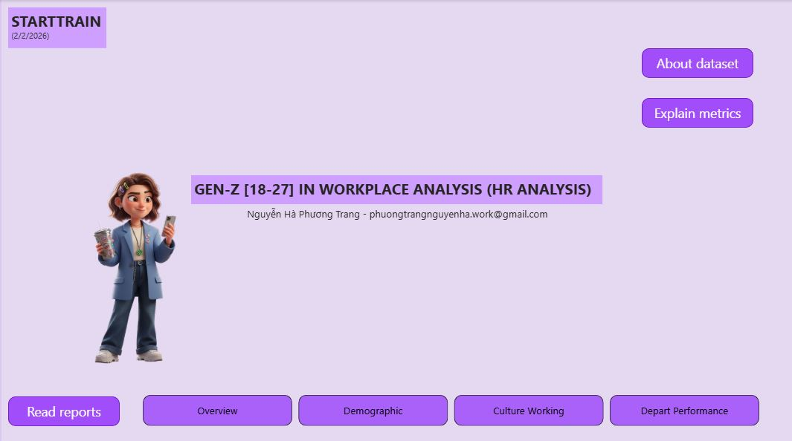

# Project Background
A fictional company, a dataset I received from Starttrain's challenge in Q1.2026, contains employee information and their performance of each department from 1988 to 2022. This project thoroughly analyzes and synthesizes this data in order to uncover critical insights that will improve people management's success. 

Insights and recommendations are provided on the following key areas:

- **Attrition rate Trend Analysis** : Evaluation of historical **attrition rate** patterns, both overvall company and each department, focusing on Attrition rate, Attrition Voluntary rate, Early Attrition rate, and Tenure Attrition rate.  
- **Demographic Attrition Analysis** : An analysis of employee group's personal aspects, understanding the employee persona who already quit job.
- **Culture Working Analysis** : An evaluation of working environmental health on **satisfaction factors, promotion years, and worklife balance**
- **Depart Performance Analysis** : An assessment benefits of each department on **average salary, average promotion year, and time spend with managers**

# Data Structure & Initial Checks

The companies main database structure as seen below consists of fifteen tables, with one fact table is Employee, and the others are dimensional tables, with a total row count of 1470 employee records. A description of each table is as follows:

**Fact table**
Employees (ID employee, age, attribute, attrition, attritionRiskIndex, businessTravel, dateBirth, dateDeparture, dateStart, dateToday, department, distanceFromHome, Education, EmploymentType, EnvironmentSatisfaction, gender, hireType, jobLevel, jobRole, jobInvolvement, jobSatisfaction, maritalStatus, numCompaniesWorked, overTime, performanceRating, relationshipSatisfaction, salary, salaryHike, stockOption, terminationType, totalWorkingYears, trainingTimeLastYear, value, workLifeBalance, yearsAtCompany, yearsSinceLastPromotion, yearsWithCurrManager)

**Dimensional table**
1. BusinessTravel (ID, businessTravel)
2. Department (ID, department)
3. HireType (ID, hireType)
4. Gender (ID, gender)
5. EnvironmentSatisfaction (ID, environmentSatisfaction)
6. RelationshipSatisfaction (ID, relationshipSatisfaction)
7. JobRole (ID, jobRole)
8. TerminationType (ID, terminationType)
9. Education (ID, education)
10. Performance (ID, performance)
11. JobInvolvement (ID, involvement)
12. EmploymentType (ID, employmentType)
13. JobSatisfaction (ID, jobSatisfaction)
14. Calendar (Date)

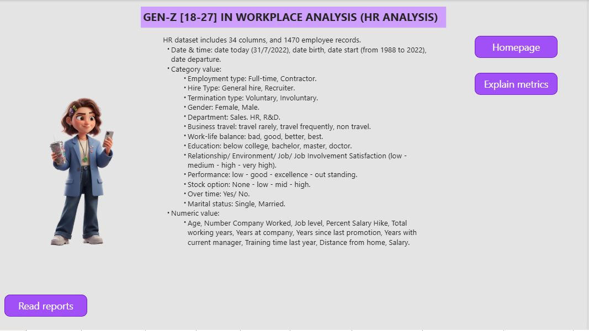

# Executive Summary

### Overview of Findings
# 📊 HR Attrition & Gen-Z Insights Analysis
> *Exploring employee turnover patterns from 1985 to 2022 with a focus on generational shifts.*

---

## In 16.12% attrition rate, Voluntary occupied 75.95% (From 1985 to 2022 years working starting overall)

  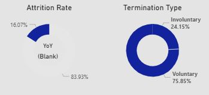

* **Attrition Rate:** `~16%` 
* **Voluntary Turnover:** Occupied **~76%** of cases.
* **Context:** Data spanning from 1985 to 2022 shows that voluntary resignation is the dominant factor in company attrition.

---

  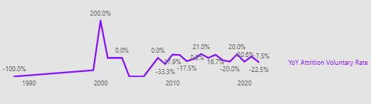

> [!NOTE]
> **The 2009 Effect:** We observe a "zigzag" shape in voluntary attrition post-2009. This suggests a lasting negative impact from the 2008 recession, leading to ineffective management and inconsistent quality in workload as employees were cut from the structure.

---
## The tenure employee of the attrition is younger (0-2) years intensely from the employee starting working in [2018-2022], who was born in 2000-2004, mainly responsible for entry, associate, and specialist job level title.

  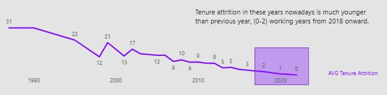

* **Target Profile:** Employees born between **2000-2004** (Current age 18-22).
* **Critical Period:** Tenure of **0-2 years** is the most intense period for attrition.
* **Hierarchy:** High impact on **Entry, Associate, and Specialist** job levels.

---

## Deep Dive: The Demographic Gen-Z
> [!WARNING]
> **Promotion Paradox:** Gen-Z professionals often resign **1-3 years after their last promotion**, or even within their **first year** (20-50% early attrition rate).

  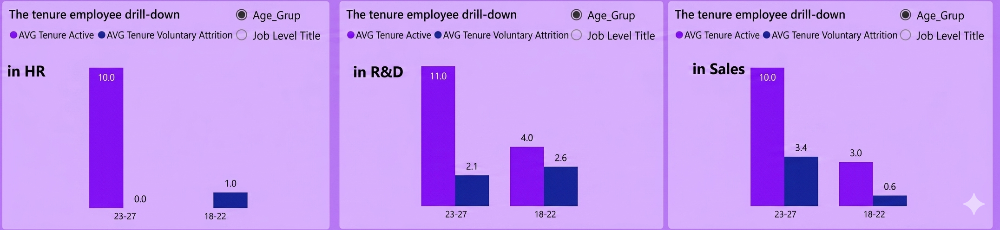

### 🔍 Key Behaviors [Age 18-27]:
* **Department Risk:** Gen-Z attrition in HR reaches an alarming **23% to 60%**.

<table align="center">
  <tr>
    <td align="center"><b>Gen-zProportion</b></td>
    <td align="center"><b>JobTitle</b></td>
  </tr>
  <tr>
    <td>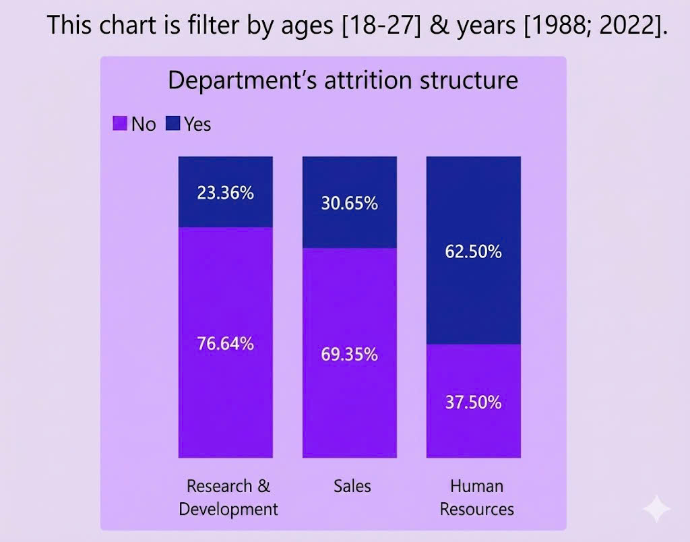</td>
    <td></td>
  </tr>
</table>

* **Department Risk:** Gen-Z attrition in HR reaches an alarming **23% to 60%**.
* **The 1.6 Year Threshold:** - **Voluntary:** Average exit occurs at **1.6 years** for junior levels.
  - **Retention:** Employees staying beyond 1.6 years show significantly higher long-term commitment.

### Gen-Z [18-27], Student/ Early career & Young professional, often quit job after [1-3] years since the last promotion
*Comparison of Tenure vs. Early Attrition vs. Overall Rate by Age.*
They also quit job at 20-50% early attrition rate. Additionally, attrition rate is high from them.

<table align="center">
  <tr>
    <td align="center"><b>Tenure by Age</b></td>
    <td align="center"><b>Early Attrition Rate</b></td>
    <td align="center"><b>Overall Attrition Rate</b></td>
  </tr>
  <tr>
    <td>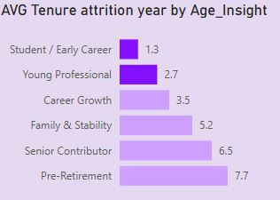</td>
    <td>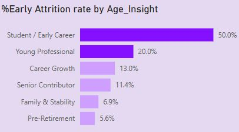</td>
    <td>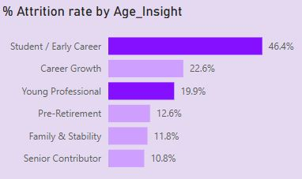</td>
  </tr>
</table>

*From starting working year 1988-2022 include just the active employee now to date, Gen-Z current, [18-27] years old, occupied (6 - 13) % in each department's structure.*

<td>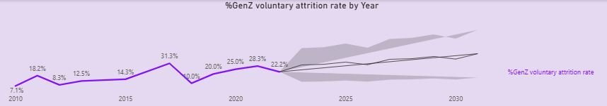</td>

**Problem: If we don't have any actions to enhance retention rate, the early attrition is more likely happen in the future. Consequently, the human management is ineffective & the skilled, young, and energy human source is shortage, especially gen Z.**
---
# Insights Deep Dive
### Demographic Analysis:

* **Main insight 1. After 3 years since the last promotion of entry level with 24% Gen-Z [18-27] quit the job, in overall year start working 1988-2022.** . There is no difference between genders.

    <td>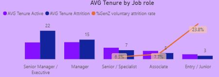</td>

    <td>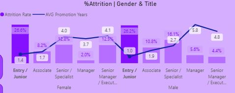</td>

Both gender also have high attrition rate in the entry role. Female is after 1.4 years and Male is after 1 year at the entry level

* **Main insight 2. High attrition rate happens in early career group, and make up the highest single status** they're still young fresher and single, having less responsibility than marital group. So they tend to be freedom in choosing jobs and unstable.

<table align="center">
  <tr>
    <td align="center"><b>By Marital Status</b></td>
    <td align="center"><b>By Age Group</b></td>
    <td align="center"><b>By Education Group</b></td>
  </tr>
  <tr>
    <td>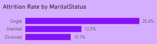</td>
    <td>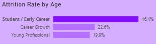</td>
    <td>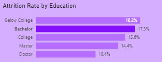</td>
  </tr>
</table>

### Culture Working Environment Analysis:

* **Main insight 1. 36.4% Gen-Z quit Job even they believe they have a best work-life balance.** However, They highly feel inconnected with job involvement, and low satisfaction environment despite of good relationship with co-workers.

  <table align="center">
  <tr>
    <td align="center"><b>By Work-life Balance</b></td>
    <td align="center"><b>By Satisfaction Factors</b></td>
  </tr>
  <tr>
    <td>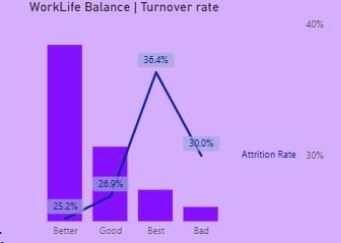</td>
    <td>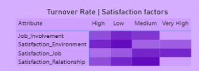</td>
  </tr>
</table>

* **Main insight 2. ~40% gen-Z at entry level after 0.83 year since the last promotion choose to quit job although they have a best work-life balance.** all of them do not have the low performance output.

  <table align="center">
  <tr>
    <td align="center"><b>By YearsSinceLastPromotion</b></td>
    <td align="center"><b>By performance</b></td>
  </tr>
  <tr>
    <td>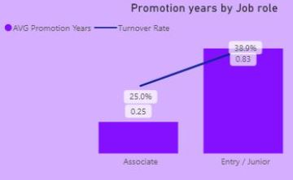</td>
    <td>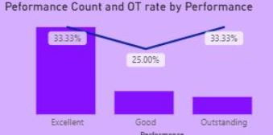</td>
  </tr>
</table>

* **Main insight 3. Low Job Involvement is also a key driver to quit the job although gen-Z have a better work-life balance.** Additionally, the training time also bring both result performance (excellent vs low) with the same time training.

  <table align="center">
  <tr>
    <td align="center"><b>Attition rate By Satisfaction factors</b></td>
    <td align="center"><b>OverTime & training time</b></td>
  </tr>
  <tr>
    <td>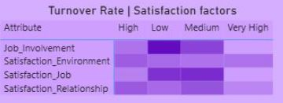</td>
    <td>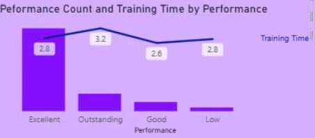</td>
  </tr>
</table>

### Department Analysis:

**Main insight : On the average tenure employee entry level is around 3.5 years they have more than 1 year without accompanying managers**

    <td>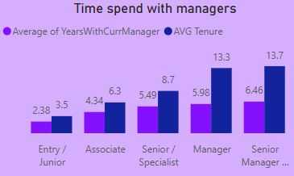</td>

# Recommendations:

Based on the insights and findings above, we would recommend the [HR team] to consider the following: 

<td>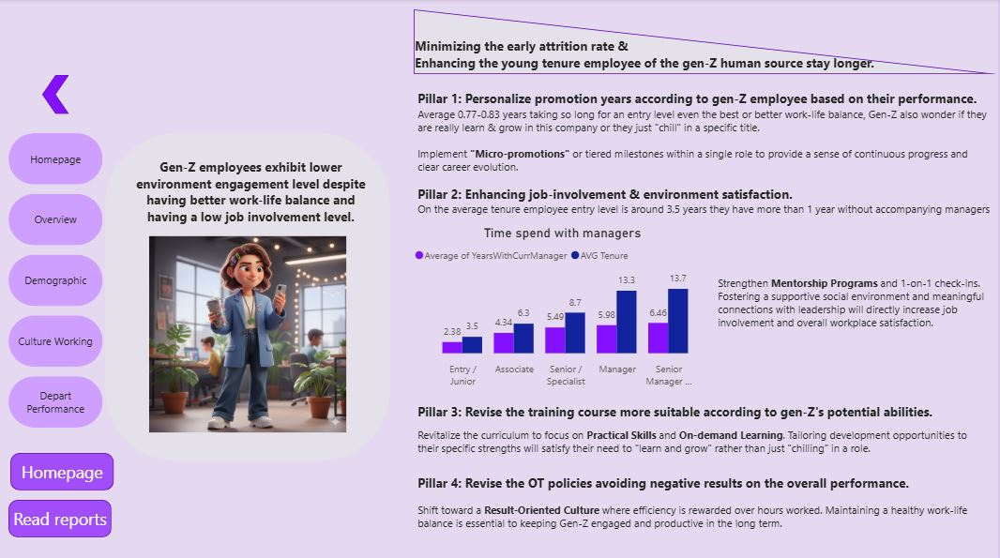</td>

